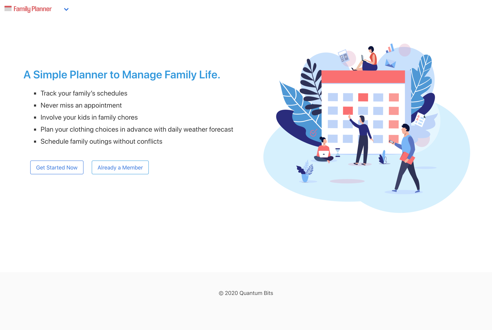
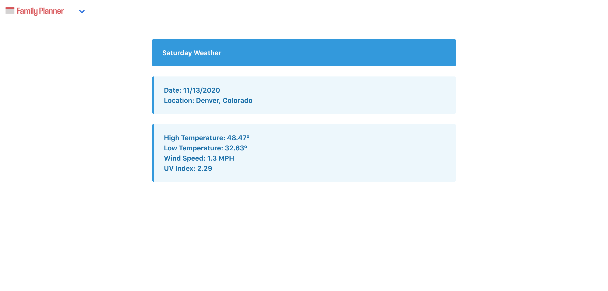
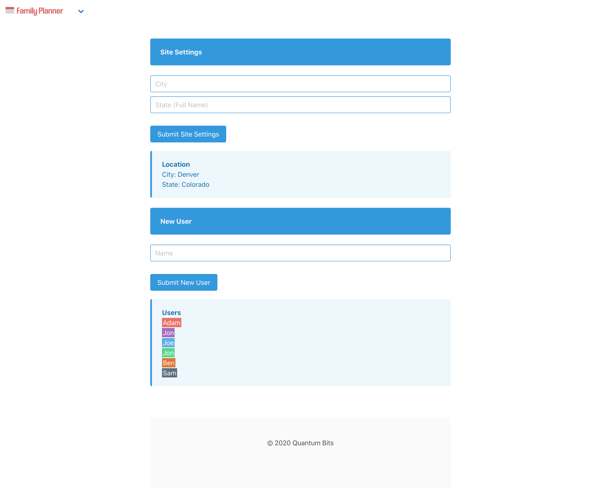
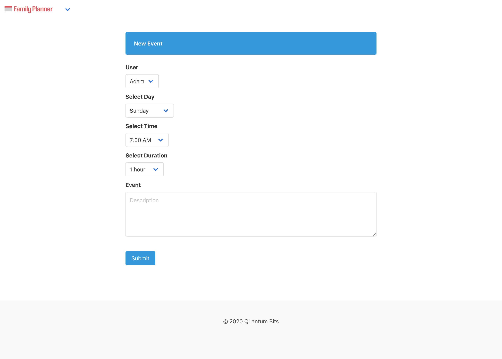

# Family Planner

---

This application will utilize server-side APIs to forecast the weather and help determine outdoor chores, activities and location. The application will be responsive and mobile-friendly utilizing a CSS framework. It is an easy planner that family members can collaborate to share schedules with each other.

---

## Requirements

GIVEN a family planner site with settings & event inputs \
WHEN a user adds a family member \
THEN the user can create scheduled events and chores for that family member \
WHEN events and chores are added, they are entered onto a shared calendar \
THEN weather information for the day along with location information is provided \
WHEN the information is presented on the calendar \
THEN the user can make determinations if the chores or events are well scheduled

## Links

* [Family Planner](https://jondnv.github.io/FamilyPlanner/)
* [Github Repository](https://github.com/JonDnv/FamilyPlannerd)
  
---

## Mock Up

The following images shows the finished site:

---

## Contributing Members

* [Kai Curtis](https://github.com/kaiasahite)
* [Jon Godwin](https://github.com/JonDnv)
* [Gil Orcilla](https://github.com/gilorcilla)
* [Korey Smith](https://github.com/smithrkorey)

---

## Contributing Technologies

* [Bulma](https://bulma.io/)
* [Font Awesome](https://fontawesome.com/)
* [jQuery](https://jquery.com/)
* [FontIcon](https://gauger.io/fonticon/)

---

## Change History

 1. Created Shell html, js, css & README files
 2. Created GitHub Pages site
 3. Created Settings & Event Creation Pages
 4. Created JS to Save Weather & Holiday Info Per Date
 5. Updated Day Planner HTML
 6. Created Landing Page HTML
 7. Updated Planner Page Table Design & Header
 8. Added Weather Dashboard Pages
 9. Added Holiday Information to Planner Page Header
 10. Populated Planner Based on Event Creation
